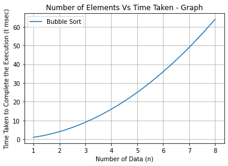
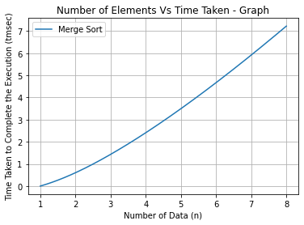
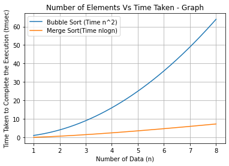

# Plot a Graph to show the performance of an Algorithm
Plotting a Graph to show the perfromance of an algorithm Python matplotlib and Google colab.

## How to use Google Colab

To start working with Colab you first need to log in to your google account, then go to this link https://colab.research.google.com


## First Plot - Bubble Sort

Use following python code to start. Press new Cell button and paste following python code. To run the python program press Run icon show in the cell. If it shows any missing packages, Enter "pip3 install scipy" in a new cell and run.

```python
import numpy as np
import numpy as np
from scipy.interpolate import make_interp_spline
import matplotlib.pyplot as plt
 
# Dataset
x = np.array([1, 2, 3, 4, 5, 6, 7, 8])
y = np.array([1, 4, 9, 16, 25, 36, 49, 64])
 
X_Y_Spline = make_interp_spline(x, y)
 
# Returns evenly spaced numbers
# over a specified interval.
X_ = np.linspace(x.min(), x.max(), 500)
Y_ = X_Y_Spline(X_)

# Plotting the Graph
plt.plot(X_, Y_,label="Bubble Sort")
plt.grid()
plt.title("Number of Elements Vs Time Taken - Graph")
plt.xlabel("Number of Data (n)")
plt.ylabel("Time Taken to Complete the Execution (t msec)")
plt.legend()
plt.show()

```
Output looks like as given below



## Second Plot - Merge Sort

```python
import numpy as np
import numpy as np
from scipy.interpolate import make_interp_spline
import matplotlib.pyplot as plt
 
# Dataset
x = np.array([1, 2, 3, 4, 5, 6, 7, 8])
y = np.array([0,0.602059991,1.431363764,2.408239965,3.494850022,4.668907502,5.91568628,7.224719896])
 
X_Y_Spline = make_interp_spline(x, y)
 
# Returns evenly spaced numbers
# over a specified interval.
X_ = np.linspace(x.min(), x.max(), 500)
Y_ = X_Y_Spline(X_)

# Plotting the Graph
plt.plot(X_, Y_,label="Merge Sort")
plt.grid()
plt.title("Number of Elements Vs Time Taken - Graph")
plt.xlabel("Number of Data (n)")
plt.ylabel("Time Taken to Complete the Execution (tmsec)")
plt.legend()
plt.show()
```

Output looks like as given below



## Multi Plots - Bublle Sort Vs Merge Sort
A plot to represent multiple graphs.

```python

import numpy as np
import numpy as np
from scipy.interpolate import make_interp_spline
import matplotlib.pyplot as plt
 
# Dataset
x = np.array([1, 2, 3, 4, 5, 6, 7, 8])
y_bubble = np.array([1, 4, 9, 16, 25, 36, 49, 64])
y_merge = np.array([0,0.602059991,1.431363764,2.408239965,3.494850022,4.668907502,5.91568628,7.224719896])
 
X_Y_bubble = make_interp_spline(x, y_bubble)
X_Y_merge = make_interp_spline(x, y_merge) 

# Returns evenly spaced numbers
# over a specified interval.
X_ = np.linspace(x.min(), x.max(), 500)
Y_bubble = X_Y_bubble(X_)
Y_merge = X_Y_merge(X_)

# Plotting the Graph
plt.plot(X_, Y_bubble,label="Bubble Sort (Time n^2)")
plt.plot(X_, Y_merge,label="Merge Sort (Time nlogn)")
plt.grid()
plt.title("Number of Elements Vs Time Taken - Graph")
plt.xlabel("Number of Data (n)")
plt.ylabel("Time Taken to Complete the Execution (tmsec)")
plt.legend()
plt.show()

```
Output looks like as given below




